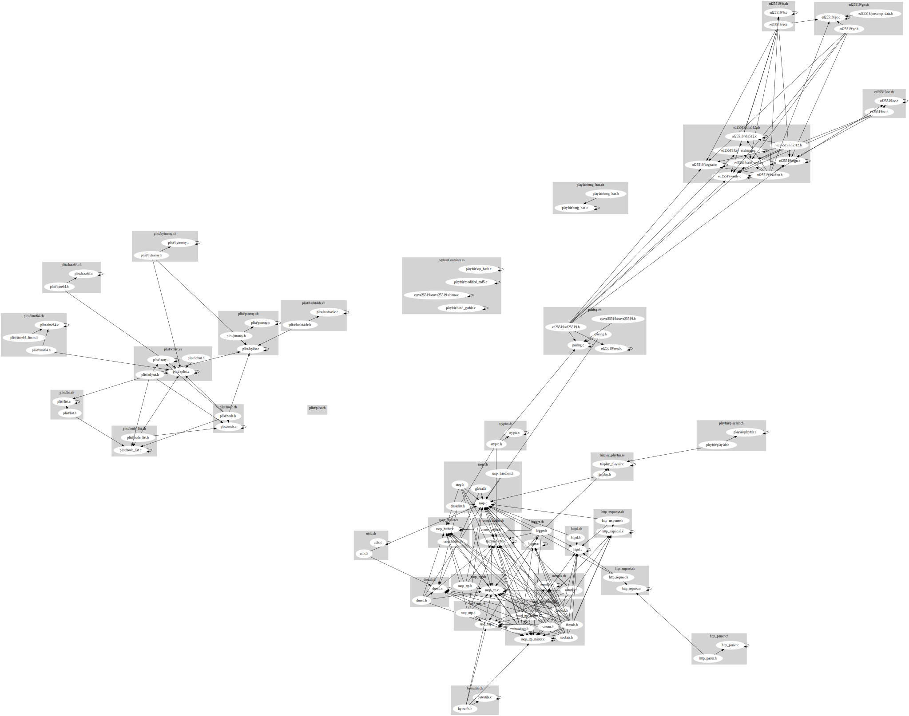

# Air Mochi

## Build

In order to build:
```bash
    .\build.sh
```

## Run

In order to run:
```bash
    .\run.sh
```

## Example "How to push raw h264 to RTMP server (SRS)"

```c
    int ret = srs_h264_write_raw_frames(rtmp, (char *) data->data,    data->data_len, data->pts, data->pts);
    if (ret != 0) {
        if (srs_h264_is_dvbsp_error(ret)) {
            srs_human_trace("ignore drop video error, code=%d", ret);
        } else if (srs_h264_is_duplicated_sps_error(ret)) {
            srs_human_trace("ignore duplicated sps, code=%d", ret);
        } else if (srs_h264_is_duplicated_pps_error(ret)) {
            srs_human_trace("ignore duplicated pps, code=%d", ret);
        } else {
            srs_human_trace("send h264 raw data failed. ret=%d", ret);
        }
    } else {
        printf("HUHUHU\n");
    }
```

This rtmp is the same srs_rtmp_t instance created by start_rtmp_connection() and later destoryed by stop_rtmp_connection() methods.

# RPiPlay Architecture Recovery

