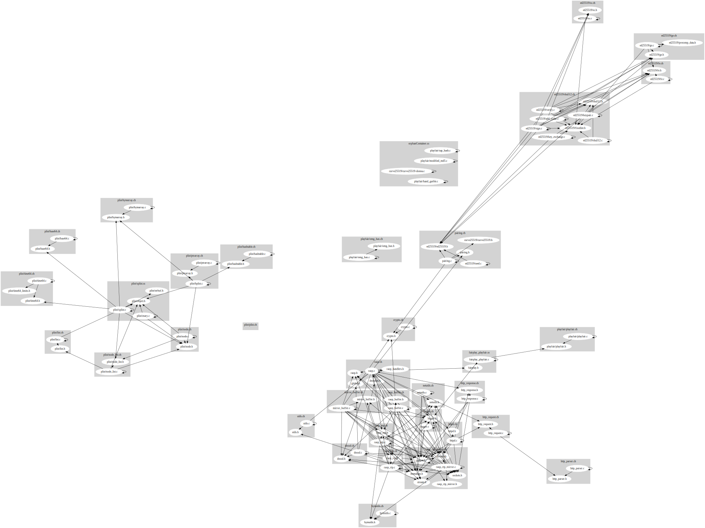

# RPiPlay Architecture Recovery

The following is the result of the ACDC clusterering and dependency extraction on RPiPlay framework, which is one of the main building blocks of our solution:

However, we are able to much better undestand the RPiPlay framework and how it works. We learned the following from the analysis:

* The library is dependant of OpenSSL version > 1.1.0 
    * This is shown to be really tricky for combining it with other parts of our solution (that are dependant on newer versions of OpenSSL).
* The video processing latency is was huge due to buffering
    * As we can see from the previous graph, once video is acquired from the device, it goes to *raop_buffer* before actually making it externally available.

The previous two are the main drawbacks that we have been faceing since the begining of the development of this solution. We solved the first, however, the solution for the second one is not there yet.

## PKG

We skipped running *PKG* since the number of packages is really small and it will not produce any sufficiant output.